# TX Investigation Agent

[](https://openjdk.org/)
[](https://spring.io/projects/spring-boot)
[](https://embabel.com)
[](https://gradle.org/)
[](https://renovatebot.com/)
[](LICENSE)

An AI-powered payment investigation agent built with [Embabel Agent Framework](https://embabel.com) and Spring Boot. It correlates data from 7 sources — microservice APIs, Temporal workflow history, Elasticsearch logs, and Jaeger distributed traces — to produce structured investigation reports for cross-border stablecoin payments.

## Architecture

The agent follows **hexagonal architecture** with strict layer isolation enforced by ArchUnit:

<p align="center">
  
</p>

### Package Structure

```
src/main/java/com/stablebridge/txinvestigation/
├── agent/                          # Embabel GOAP agent layer
│   ├── InvestigationAgent.java     #   10 GOAP actions (2 LLM + 7 fetch + 1 format)
│   └── InvestigationPersonas.java  #   Senior Investigator persona
├── application/controller/         # REST API layer
│   ├── InvestigationController.java
│   ├── InvestigationRequest.java
│   └── InvestigationResponse.java
├── domain/                         # Pure domain — no framework deps
│   ├── model/                      #   19 records, 6 enums, 2 exceptions
│   ├── port/                       #   7 provider interfaces
│   └── service/                    #   ReportFormatter
├── infrastructure/                 # Adapters & config
│   ├── blockchain/                 #   BlockchainAdapter (WebClient)
│   ├── compliance/                 #   ComplianceAdapter (WebClient)
│   ├── config/                     #   ServiceProperties, WebClientConfig
│   ├── ledger/                     #   LedgerAdapter (WebClient)
│   ├── elasticsearch/              #   ElasticsearchAdapter (WebClient POST)
│   ├── mock/                       #   MockAdaptersConfig (@ConditionalOnMissingBean)
│   ├── orchestrator/               #   OrchestratorAdapter (WebClient)
│   ├── temporal/                   #   TemporalAdapter (WebClient)
│   └── tracing/                    #   TracingAdapter (WebClient)
└── shell/                          # Spring Shell interactive CLI
    └── InvestigationCommands.java
```

### Layer Rules (ArchUnit-enforced)

| Rule | Description |
|------|-------------|
| Domain isolation | Domain must not depend on agent, application, infrastructure, or shell |
| No Spring Web in domain | Domain must not use WebClient or Spring Web annotations |
| Infrastructure isolation | Infrastructure must not depend on agent layer |

## How It Works

### GOAP Agent Pipeline

The Embabel agent uses [Goal-Oriented Action Planning](https://embabel.com/docs/snapshot/concepts/goap/) to chain 10 actions:

<p align="center">
  
</p>

- **`parseQuery`** — LLM extracts payment ID, merchant ID, and corridor from natural language input
- **7 fetch actions** — parallel data collection from microservice APIs + observability systems via hexagonal ports
- **`analyzeTimeline`** — LLM with Senior Investigator persona correlates events across all 7 data sources, identifies root cause, produces findings with severity/category
- **`formatReport`** — assembles the final report with markdown timeline, findings, and recommendations

### Domain Model

<p align="center">
  
</p>

| Type | Purpose |
|------|---------|
| `InvestigationQuery` | Parsed user input: paymentId, merchantId, corridor |
| `PaymentState` | Orchestrator saga status, workflow ID, saga events |
| `ComplianceSnapshot` | Screening result, travel rule status, risk score, decisions |
| `BlockchainSnapshot` | TX hash, chain, confirmations, amount, sender/receiver |
| `LedgerSnapshot` | Ledger entries, net position, settlement status |
| `WorkflowSnapshot` | Temporal workflow execution: events, activities, retries, task queue |
| `LogSnapshot` | Elasticsearch error/warn logs: entries, stack traces, trace correlation |
| `TraceSnapshot` | Jaeger distributed trace: spans, latency, service-level errors |
| `InvestigationReport` | LLM-generated: severity, root cause, timeline, findings, recommendations |
| `CompletedInvestigation` | Final assembly of all 7 data sources + formatted markdown report |

### Finding Categories

| Category | Description |
|----------|-------------|
| `STUCK_PAYMENT` | Payment stuck at a saga step |
| `COMPLIANCE_BLOCK` | Sanctions/AML screening block |
| `BLOCKCHAIN_DELAY` | On-chain confirmation delay |
| `SETTLEMENT_MISMATCH` | Ledger balance discrepancy |
| `SLA_BREACH` | Processing time exceeded SLA |
| `RECONCILIATION_GAP` | Cross-service data inconsistency |
| `WORKFLOW_FAILURE` | Temporal activity failure or timeout |
| `ERROR_SPIKE` | High error rate detected in logs |
| `LATENCY_ANOMALY` | Abnormal span duration in traces |

### Severity Levels

`CRITICAL` > `HIGH` > `MEDIUM` > `LOW` > `INFO`

## Getting Started

### Prerequisites

- **Java 25**
- **Gradle 9.3.1**
- *(Optional)* An LLM API key — only needed for full GOAP agent with LLM actions

### Build & Test

```bash
# Run all tests (43 unit + 3 integration) — no API keys needed
./gradlew check

# Unit tests only
./gradlew test

# Integration tests only
./gradlew integrationTest
```

All 46 tests use mocked providers and Embabel's test harness — no live services or LLM API keys required.

### Run

```bash
# Start with mock adapters (no live services needed)
./gradlew bootRun

# Start with live service URLs
ORCHESTRATOR_URL=http://localhost:8081 \
COMPLIANCE_URL=http://localhost:8082 \
BLOCKCHAIN_URL=http://localhost:8083 \
LEDGER_URL=http://localhost:8084 \
TEMPORAL_URL=http://localhost:7233 \
ELASTICSEARCH_URL=http://localhost:9200 \
TRACING_URL=http://localhost:16686 \
./gradlew bootRun
```

When no live services are configured, `MockAdaptersConfig` provides realistic fallback data — the app runs fully standalone.

### Testing Levels

The agent can be tested at three levels, each requiring progressively more setup:

#### Level 1 — Automated Tests (no setup)

```bash
./gradlew check
```

Runs 46 tests covering all layers: ArchUnit rules, WireMock adapter tests, agent action wiring, controller endpoints, and shell commands. Everything is mocked — no API keys or running services needed.

#### Level 2 — REST API & Shell (Ollama LLM)

```bash
# Ensure Ollama is running with llama3.2
ollama serve && ollama pull llama3.2
./gradlew bootRun
```

The REST endpoint and Shell command call all 7 providers, send the aggregated data to the local Ollama LLM for analysis, and return a structured investigation report. Mock adapters provide realistic data when no live services are configured.

**Spring Shell:**

```
embabel> investigate PAY-001
```

**REST API:**

```bash
curl -X POST http://localhost:8080/api/v1/investigations \
  -H "Content-Type: application/json" \
  -d '{"paymentId": "PAY-001"}'
```

**Sample LLM Response:**

```json
{
  "paymentId": "PAY-001",
  "status": "BLOCKCHAIN_PENDING",
  "severity": "HIGH",
  "rootCause": "Custody service failed to submit tx 0xmock123abc456 — gas price spike to 45 gwei exceeded 20 gwei limit at saga step BLOCKCHAIN_SUBMIT",
  "findings": [
    {
      "category": "COMPLIANCE_BLOCK",
      "severity": "INFO",
      "description": "Compliance check passed successfully"
    },
    {
      "category": "BLOCKCHAIN_DELAY",
      "severity": "HIGH",
      "description": "Blockchain submit step failed due to gas price spike"
    },
    {
      "category": "SLA_BREACH",
      "severity": "MEDIUM",
      "description": "Transaction confirmation timeout approaching SLA"
    },
    {
      "category": "ERROR_SPIKE",
      "severity": "MEDIUM",
      "description": "Gas price spike detected — retry pending"
    },
    {
      "category": "LATENCY_ANOMALY",
      "severity": "LOW",
      "description": "Blockchain custody service latency anomaly detected"
    }
  ],
  "timeline": [
    {
      "timestamp": "2026-03-09T05:15:42Z",
      "service": "payment-orchestrator",
      "description": "Workflow started",
      "status": "RUNNING"
    },
    {
      "timestamp": "2026-03-09T05:30:42Z",
      "service": "compliance-travel-rule",
      "description": "Compliance check scheduled",
      "status": "PENDING"
    },
    {
      "timestamp": "2026-03-09T05:31:42Z",
      "service": "compliance-travel-rule",
      "description": "Compliance check completed",
      "status": "COMPLETED"
    },
    {
      "timestamp": "2026-03-09T05:31:42Z",
      "service": "fiat-on-ramp",
      "description": "Fiat collection scheduled",
      "status": "PENDING"
    },
    {
      "timestamp": "2026-03-09T05:31:42Z",
      "service": "fiat-on-ramp",
      "description": "Fiat collection completed",
      "status": "COMPLETED"
    },
    {
      "timestamp": "2026-03-09T06:00:42Z",
      "service": "blockchain-custody",
      "description": "Blockchain submit scheduled",
      "status": "PENDING"
    },
    {
      "timestamp": "2026-03-09T06:00:42Z",
      "service": "blockchain-custody",
      "description": "Blockchain submit failed",
      "status": "FAILED"
    }
  ],
  "recommendation": "Resubmit transaction 0xmock123abc456 via custody service /api/v1/retry with updated gas fee",
  "errorLogCount": 2,
  "traceId": "trace-mock-001",
  "workflowStatus": "RUNNING",
  "formattedReport": "## Investigation Report: PAY-001 ..."
}
```

#### Level 3 — Full GOAP Agent with LLM

Embabel bundles Spring AI but **no LLM provider**. To run the LLM-powered `parseQuery` and `analyzeTimeline` actions, add an Embabel LLM starter to `build.gradle.kts`:

**Option A — OpenAI:**

```kotlin
implementation("com.embabel.agent:embabel-agent-starter-openai:$embabelVersion")
```

```bash
OPENAI_API_KEY=sk-... ./gradlew bootRun
```

**Option B — Anthropic (Claude):**

```kotlin
implementation("com.embabel.agent:embabel-agent-starter-anthropic:$embabelVersion")
```

```bash
ANTHROPIC_API_KEY=sk-ant-... ./gradlew bootRun
```

**Option C — Ollama (free, local, no API key):**

```kotlin
implementation("com.embabel.agent:embabel-agent-starter-ollama:$embabelVersion")
```

```yaml
# Add to application.yml
embabel:
  models:
    default-llm: qwen2.5:latest  # or llama3.2:latest
```

```bash
ollama serve && ollama pull qwen2.5
./gradlew bootRun
```

With an LLM provider configured, the full GOAP pipeline runs: `parseQuery` (LLM) → 7 parallel fetches → `analyzeTimeline` (LLM with Senior Investigator persona) → `formatReport`.

## Configuration

### Service Endpoints

Configure via `application.yml` or environment variables:

```yaml
app:
  services:
    orchestrator:
      base-url: ${ORCHESTRATOR_URL:http://localhost:8081}
    compliance:
      base-url: ${COMPLIANCE_URL:http://localhost:8082}
    blockchain:
      base-url: ${BLOCKCHAIN_URL:http://localhost:8083}
    ledger:
      base-url: ${LEDGER_URL:http://localhost:8084}
    temporal:
      base-url: ${TEMPORAL_URL:http://localhost:7233}
    elasticsearch:
      base-url: ${ELASTICSEARCH_URL:http://localhost:9200}
    tracing:
      base-url: ${TRACING_URL:http://localhost:16686}
```

### Mock Adapters

When no live service is available, `MockAdaptersConfig` provides fallback implementations via `@ConditionalOnMissingBean`. These return realistic sample data so the agent can run standalone for development and demos.

### Adapter Activation

<p align="center">
  
</p>

| Condition | Adapter |
|-----------|---------|
| `app.services.orchestrator.enabled=true` | `OrchestratorAdapter` (WebClient) |
| `app.services.compliance.enabled=true` | `ComplianceAdapter` (WebClient) |
| `app.services.blockchain.enabled=true` | `BlockchainAdapter` (WebClient) |
| `app.services.ledger.enabled=true` | `LedgerAdapter` (WebClient) |
| `app.services.temporal.enabled=true` | `TemporalAdapter` (WebClient) |
| `app.services.elasticsearch.enabled=true` | `ElasticsearchAdapter` (WebClient POST) |
| `app.services.tracing.enabled=true` | `TracingAdapter` (WebClient) |
| No real adapter present | `MockAdaptersConfig` fallback |

## Tech Stack

| Component | Version |
|-----------|---------|
| Java | 25 |
| Spring Boot | 4.0.3 |
| Embabel Agent Framework | 0.3.4 |
| Spring Shell | 3.4 |
| Spring WebFlux | (via Boot) |
| Lombok | 1.18.42 |
| Jackson 3 | (via Boot) |
| ArchUnit | 1.4.1 |
| WireMock | 3.13.2 |
| JaCoCo | 0.8.14 |
| Spotless | 8.3.0 |
| Gradle | 9.3.1 (Kotlin DSL) |

## Test Suite

**46 tests** across 3 categories:

### Unit Tests (43)

| Test Class | Tests | What It Covers |
|------------|-------|----------------|
| `ArchitectureTest` | 7 | Hexagonal layer isolation rules |
| `InvestigationAgentTest` | 8 | Agent actions with mocked ports (7 fetch + formatReport) |
| `ReportFormatterTest` | 4 | Markdown report generation |
| `OrchestratorAdapterTest` | 3 | WireMock — success, 404, 500 |
| `ComplianceAdapterTest` | 3 | WireMock — success, 404, 500 |
| `BlockchainAdapterTest` | 3 | WireMock — success, 404, 500 |
| `LedgerAdapterTest` | 3 | WireMock — success, 404, 500 |
| `TemporalAdapterTest` | 3 | WireMock — workflow history, 404, 500 |
| `ElasticsearchAdapterTest` | 3 | WireMock — search, index-not-found, 500 |
| `TracingAdapterTest` | 3 | WireMock — trace fetch, empty, 500 |
| `InvestigationControllerTest` | 2 | REST endpoint + validation |
| `InvestigationCommandsTest` | 1 | Shell command with all 7 providers |

### Integration Tests (3)

| Test Class | Tests | What It Covers |
|------------|-------|----------------|
| `InvestigationAgentIntegrationTest` | 3 | Embabel GOAP agent — full pipeline, 7 provider ports, formatted report |

### Test Fixtures

All test data is centralized in `src/testFixtures/java/.../fixtures/`:

| Fixture | Factory Method |
|---------|---------------|
| `InvestigationQueryFixtures` | `anInvestigationQuery()` |
| `PaymentStateFixtures` | `aPaymentState()` |
| `ComplianceSnapshotFixtures` | `aComplianceSnapshot()` |
| `BlockchainSnapshotFixtures` | `aBlockchainSnapshot()` |
| `LedgerSnapshotFixtures` | `aLedgerSnapshot()` |
| `InvestigationReportFixtures` | `anInvestigationReport()` |
| `WorkflowSnapshotFixtures` | `aWorkflowSnapshot()` |
| `LogSnapshotFixtures` | `aLogSnapshot()` |
| `TraceSnapshotFixtures` | `aTraceSnapshot()` |
| `CompletedInvestigationFixtures` | `aCompletedInvestigation()` |

## Sample Report Output

The `formattedReport` field in the API response contains a markdown-rendered investigation report. Here is a real example generated by the Ollama `llama3.2:latest` model with the **Senior Blockchain Payments Engineer** persona:

```markdown
## Investigation Report: PAY-001

**Status:** BLOCKCHAIN_PENDING | **Severity:** HIGH

### Root Cause
Custody service failed to submit tx 0xmock123abc456 — gas price spike to 45 gwei exceeded 20 gwei limit at saga step BLOCKCHAIN_SUBMIT

### Timeline
| Time | Service | Event | Status |
|------|---------|-------|--------|
| 2026-03-09 05:15:42 UTC | payment-orchestrator | Workflow started | RUNNING |
| 2026-03-09 05:30:42 UTC | compliance-travel-rule | Compliance check scheduled | PENDING |
| 2026-03-09 05:31:42 UTC | compliance-travel-rule | Compliance check completed | COMPLETED |
| 2026-03-09 05:31:42 UTC | fiat-on-ramp | Fiat collection scheduled | PENDING |
| 2026-03-09 05:31:42 UTC | fiat-on-ramp | Fiat collection completed | COMPLETED |
| 2026-03-09 06:00:42 UTC | blockchain-custody | Blockchain submit scheduled | PENDING |
| 2026-03-09 06:00:42 UTC | blockchain-custody | Blockchain submit failed | FAILED |

### Findings
- [INFO] **[COMPLIANCE_BLOCK]** Compliance check passed successfully
- [HIGH] **[BLOCKCHAIN_DELAY]** Blockchain submit step failed due to gas price spike
- [MEDIUM] **[SLA_BREACH]** Transaction confirmation timeout approaching SLA
- [MEDIUM] **[ERROR_SPIKE]** Gas price spike detected — retry pending
- [LOW] **[LATENCY_ANOMALY]** Blockchain custody service latency anomaly detected

### Recommendation
Resubmit transaction 0xmock123abc456 via custody service /api/v1/retry with updated gas fee

---
*Generated by TX Investigation Agent (Embabel + Spring AI)*
```

## Project Structure

```
tx-investigation-agent/
├── build.gradle.kts              # Kotlin DSL build (Spring Boot 4, Embabel 0.3.4)
├── settings.gradle.kts           # Root project config, build cache
├── gradle.properties             # Version properties
├── src/
│   ├── main/
│   │   ├── java/                 # Production source
│   │   └── resources/
│   │       └── application.yml   # Service URLs, Spring Shell config
│   ├── test/
│   │   ├── java/                 # Unit tests
│   │   └── resources/
│   │       └── archunit.properties
│   ├── testFixtures/
│   │   └── java/                 # Shared test fixtures
│   └── integration-test/
│       ├── java/                 # Integration tests (Embabel GOAP)
│       └── resources/
│           └── application.yml   # Test config (services disabled)
└── services/
    └── 01-architecture-spec.md   # Full architecture specification
```

## License

Proprietary - StableBridge
