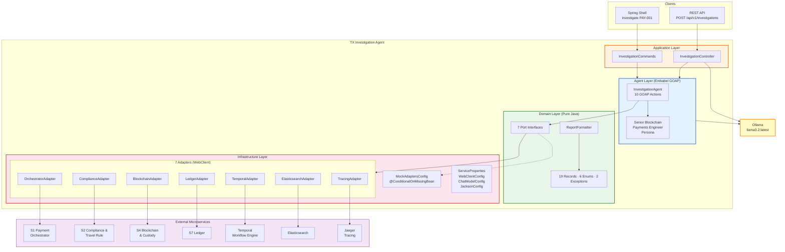
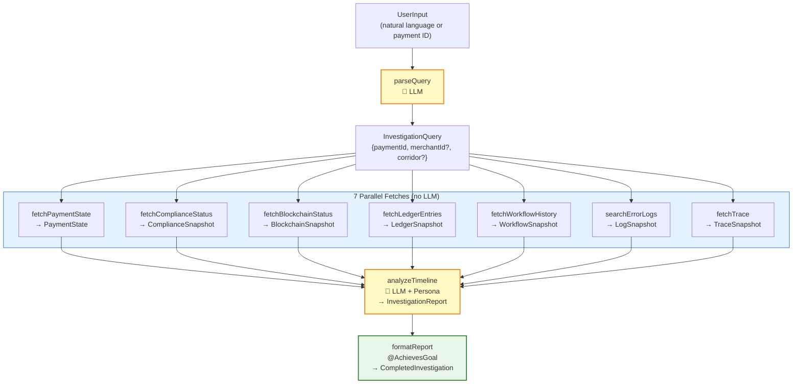
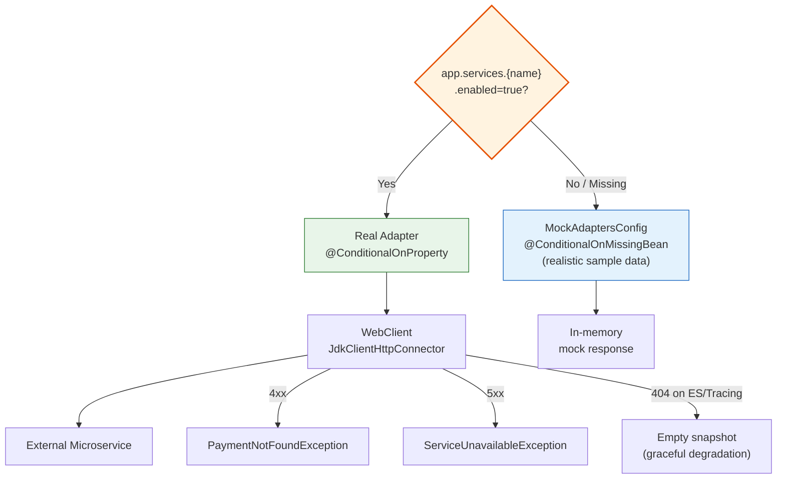
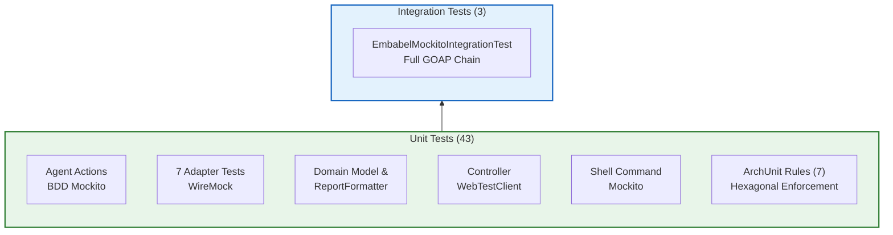

# TX Investigation Agent — Architecture Diagrams

## 1. High-Level System Architecture

## 2. GOAP Pipeline Flow

## 3. Adapter Activation Strategy

## 4. Test Pyramid

## 5. Domain Model Relationships

```mermaid
classDiagram
    class InvestigationQuery {
        String paymentId
        String merchantId
        String corridor
    }

    class CompletedInvestigation {
        InvestigationQuery query
        PaymentState paymentState
        ComplianceSnapshot complianceSnapshot
        BlockchainSnapshot blockchainSnapshot
        LedgerSnapshot ledgerSnapshot
        WorkflowSnapshot workflowSnapshot
        LogSnapshot logSnapshot
        TraceSnapshot traceSnapshot
        InvestigationReport report
        String formattedBody
    }

    class PaymentState {
        String paymentId
        PaymentStatus status
        String sagaStep
        String workflowId
        List~SagaEvent~ events
    }

    class ComplianceSnapshot {
        String paymentId
        ScreeningResult screeningResult
        String travelRuleStatus
        String riskScore
        List~ComplianceDecision~ decisions
    }

    class BlockchainSnapshot {
        String paymentId
        String txHash
        String chain
        int confirmations
        String amount
    }

    class LedgerSnapshot {
        String paymentId
        List~LedgerEntry~ entries
        String netPosition
        String settlementStatus
    }

    class WorkflowSnapshot {
        String paymentId
        String workflowId
        String status
        List~WorkflowEvent~ events
    }

    class LogSnapshot {
        String paymentId
        int totalHits
        List~LogEntry~ entries
    }

    class TraceSnapshot {
        String paymentId
        String traceId
        int totalSpans
        long durationMs
        List~TraceSpan~ spans
    }

    class InvestigationReport {
        List~TimelineEvent~ timeline
        String rootCause
        List~Finding~ findings
        String recommendation
        InvestigationSeverity severity
    }

    CompletedInvestigation --> InvestigationQuery
    CompletedInvestigation --> PaymentState
    CompletedInvestigation --> ComplianceSnapshot
    CompletedInvestigation --> BlockchainSnapshot
    CompletedInvestigation --> LedgerSnapshot
    CompletedInvestigation --> WorkflowSnapshot
    CompletedInvestigation --> LogSnapshot
    CompletedInvestigation --> TraceSnapshot
    CompletedInvestigation --> InvestigationReport
    PaymentState --> "0..*" SagaEvent
    ComplianceSnapshot --> "0..*" ComplianceDecision
    LedgerSnapshot --> "0..*" LedgerEntry
    WorkflowSnapshot --> "0..*" WorkflowEvent
    LogSnapshot --> "0..*" LogEntry
    TraceSnapshot --> "0..*" TraceSpan
    InvestigationReport --> "0..*" TimelineEvent
    InvestigationReport --> "0..*" Finding

    class SagaEvent { }
    class ComplianceDecision { }
    class LedgerEntry { }
    class WorkflowEvent { }
    class LogEntry { }
    class TraceSpan { }
    class TimelineEvent { }
    class Finding { }
```

